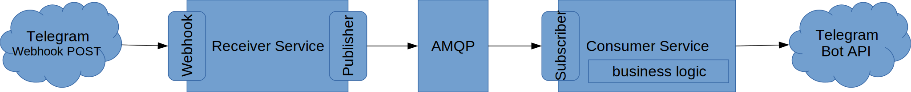

# Telegram Bot Updates Receiver Service

The objective of this project is to build a microservice that receives updates from a Telegram Bot through Webhook, and publishes them on a message broker or queue system (like MQTT, AMQP, Kafka or Redis), to be consumed by one or more processing microservices.

**This project is currently a Proof of Concept.**

## Architecture

A very basic architecture would involve three services:

- A message broker/queue service
- The Receiver Service (current repository)
- A Consumer Service, that consumes updates and processes them, including all the business logic behind the bot - ending with calls to the Telegram Bot API to send responses to the users



## Why

### Advantages

- The Consumer Services can be developed without having to deal with the development and/or implementation of the Webhook updates receiver
- Multiple consumer microservices can be deployed, for redundancy and/or to keep different business logic

### Disadvantages

- Maintaining multiple microservices can be overkill in many use-cases
- If using multiple Consumer Services, synchronization between them must be implemented if required (e.g. for caching data or keeping context of messages received)
- Some libraries do not allow injecting arbitrary Telegram Bot Updates JSON data

## Getting started

The following steps will start running the service out of the box, using Docker and ngrok:

1. You must own a Telegram bot. If not, create it from BotFather. You will need the bot token.
2. Download ngrok, and start running it as following:
   ```bash
   ./ngrok http 8025
   ```
3. Copy the `sample.env` file as `.env`, and complete the following settings
   - `TELEGRAM_TOKEN` with you bot token
   - `WEBHOOK_DOMAIN` with the domain that ngrok is currently using, including `https://` (notice that ngrok free plan will change the domain periodically)
4. Start running the webhook receiver service:
   ```bash
   docker run --rm -it -p 8025:8025 -e GIT_REPOSITORY="https://github.com/David-Lor/TelegramBot-Webhook-Updates-Receiver-Service" --env-file=".env" davidlor/python-git-app:slim
   ```
5. Send something to your bot. You should see some output on the container

### Example: pytelegrambotapi + redis

A Telegram Bot backend example is available [here](https://github.com/David-Lor/TelegramBot-Webhook-Updates-Receiver-Service/tree/example/pytelegrambotapi%2Bredis/telegrambot_client). It can be deployed with the following commands:

```bash
# Start ngrok
./ngrok http 8025

# Add the REDIS_URL & REDIS_QUEUE_NAME settings (for both server & client) - Ensure you already have copied and modified a .env file!
echo "REDIS_URL=redis://telegrambot-redis:6379" >> .env
echo "REDIS_QUEUE_NAME=TelegramBotQueue" >> .env

# Create a docker network for the services
docker network create telegrambot-net

# Start the Redis server
docker run -d --name=telegrambot-redis --network=telegrambot-net redis

# Start the webhook server (receive updates through webhook, enqueue on Redis)
docker run -d --name=telegrambot-receiver -p 8025:8025 --net=telegrambot-net -e GIT_REPOSITORY="https://github.com/David-Lor/TelegramBot-Webhook-Updates-Receiver-Service" --env-file=".env" davidlor/python-git-app:slim

# Start the Telegram bot backend (read updates from Redis queue, process them)
docker run -d --name=telegrambot-backend --net=telegrambot-net -e GIT_REPOSITORY="https://github.com/David-Lor/TelegramBot-Webhook-Updates-Receiver-Service" -e GIT_BRANCH="example/pytelegrambotapi+redis" --env-file=".env" davidlor/python-git-app:slim
```

## Settings

Settings are defined using environment variables, or a .env file. Variables defined as environment variables will override those defined in the .env file.

- **General**
  - **ENV_FILE**: (default: `.env`) path of the .env file to load settings from. If the file does not exist or cannot be found, settings will not load from .env file.
  - **PUBLISHER_CONNECT_TIMEOUT**: (default: `10`) timeout in seconds for all publishers to initialize/connect on service startup.
  - **TEARDOWN_TIMEOUT**: (default: `10`) timeout in seconds for all teardown operations, executed when service is closed.
- **Webhook**
  - **WEBHOOK_DOMAIN**: (**required**) domain where webhook is served, including "https://" or "http://", but NOT the endpoint. Must include the port if different from 443 (https) or 80 (http).
  - **WEBHOOK_ENDPOINT**: (default: `random`) endpoint where Telegram will send Webhook POST requests. With the domain, forms the webhook URL that is sent to Telegram to send bot updates to. Can be one of:
    - `random`: generate a random UUID4 string as endpoint, each time the application starts
    - `token`: use the bot token as endpoint
    - any other valid string will be used as-is as endpoint
  - **WEBHOOK_BIND**: (default: `0.0.0.0`) address to host the webhook server on.
  - **WEBHOOK_PORT**: (default: `8000`) port to host the webhook server on.
  - **WEBHOOK_STATUS_ENDPOINT**: (default: `true`) if false, do not serve a `/status` endpoint, accessible from any host to verify that the server is accessible.
  - **WEBHOOK_PUBLISH_TIMEOUT**: (default: `5`) timeout in seconds for publishing webhook received data in all publishers.
  - **WEBHOOK_LIMIT_SUBNETS**: (optional) comma-separated list of networks, with the format `ip/mask`, that can be used for limiting access to the webhook endpoint to hosts from these subnetworks. The subnetworks used by Telegram, as stated [in their documentation](https://core.telegram.org/bots/webhooks), would be `149.154.160.0/20,91.108.4.0/22` (keep in mind that these could change in the future). If not specified, no limitations will be applied.
- **Telegram**
  - **TELEGRAM_TOKEN**: (**required**) Telegram Bot token.
  - **TELEGRAM_DELETE_WEBHOOK**: (default: `true`) if true, delete the webhook when the application closes.
- **Redis**
  - **REDIS_URL**: (optional) if specified, put bot updates on a queue of the given Redis server. URL example: `redis://localhost:6379`.
  - **REDIS_QUEUE_NAME**: (default: `telegram_bot`) name of the Redis queue where bot updates are put.

## Upcoming features...

- MQTT integration
- AMQP integration
- Integrate with ngrok (auto-load domain from Free plan)
- Allow creating and/or using self-signed certificates
- Make the service a library that can be imported on existing bots, so no microservice pattern would be required
- Refactor example (do not use other branch) when `davidlor/python-git-app` Docker image supports arbitrary Python script running

## Changelog

_Versions prior 1.0.0 are considered experimental and breaking changes may occur on MINOR versions (0.x)_

- 0.1.0
    - Final version
    - Redis integration
- 0.0.1
    - Initial PoC script
